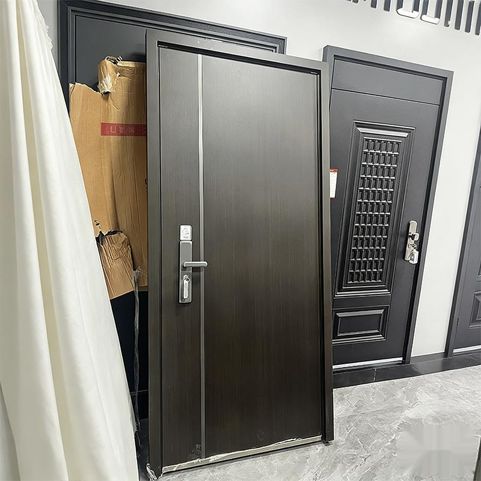

# GuiXuAI (万智归墟)

简体中文 | [English](README_EN.md)

## 项目定位

GuiXuAI 是一个面向浏览器自动化场景的统一 AI API 网关。  
它把多来源的 Web AI 能力封装为统一接口，降低接入复杂度，让业务侧可以用一致协议快速上线。

## 核心能力

- 统一 API：对外提供 OpenAI 兼容接口
- 多实例隔离：支持多账号、多会话并行运行
- 稳定调度：内置队列、重试、故障转移
- 可视化控制：提供 Web 管理界面用于配置、日志与状态查看

## 示例效果

图像编辑场景示例：将实拍门体图处理为白底电商正视图。

### 前后对比

原图（场景图）  


处理后（白底电商正视图）  


### 处理过程说明

1. 输入原图：使用实拍场景图作为参考图输入。  
2. 指令约束：要求“去背景、纯白底、主体居中、正视图、保留材质细节”。  
3. 图像编辑：通过图像模型执行图生图/编辑流程。  
4. 结果校验：输出电商可用主图，背景杂物已清理，主体完整保留。

## 快速开始

### 环境要求

- Node.js 20+
- pnpm

### 本地运行

```bash
pnpm install
npm run init
npm start
```

首次启动后会自动生成 `data/config.yaml`，你只需配置鉴权密钥并重启服务：

```yaml
server:
  port: 3000
  auth: sk-change-me-to-your-secure-key
```

## Docker 部署

```bash
docker run -d --name guixuai \
  -p 3000:3000 \
  -v "$(pwd)/data:/app/data" \
  --shm-size=2gb \
  ghcr.io/shifeihua-top/guixuai:latest
```

或使用：

```bash
docker-compose up -d
```

## API 概览

- `GET /v1/models`：获取可用模型
- `POST /v1/chat/completions`：统一推理与生成入口
- `GET /v1/cookies`：排查会话状态
- `npm run mcp:start`：启动 MCP Server（stdio）

请求鉴权：

```http
Authorization: Bearer <server.auth>
```

## MCP 快速接入

项目内置 MCP Server，可用于 OpenClaw / 通用 MCP 客户端：

```bash
GUIXUAI_BASE_URL=http://127.0.0.1:3000 \
GUIXUAI_API_TOKEN=sk-your-token \
npm run mcp:start
```

## 文档导航

- [文档总览](docs/README.md)
- [通用 API 指南](docs/UNIVERSAL_API_GUIDE.md)
- [MCP 接入指南](docs/MCP_GUIDE.md)
- [部署与运维指南](docs/DEPLOYMENT_GUIDE.md)
- [适配器开发指南](docs/ADAPTER_GUIDE.md)
- [dou包场景示例](docs/DOUBAO_EXAMPLES.md)
- [电商场景扩展示例](docs/JD_AUTOMATION.md)

## 安全建议

- 生产环境务必启用强鉴权密钥
- 对公网访问启用 HTTPS 或隧道
- 定期轮换密钥并限制管理端暴露范围
