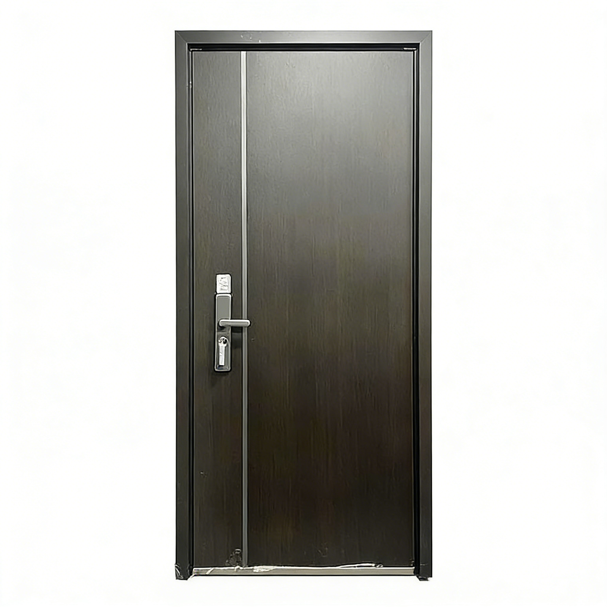

# VoidHub (GuiXuAI / 万智归墟)

[简体中文](README.md) | English

## Overview

VoidHub is a unified AI API gateway built for browser-automation-based AI access.  
It standardizes heterogeneous web AI capabilities behind one consistent API so application teams can integrate faster with less coupling.

## Core Capabilities

- Unified API surface: OpenAI-compatible endpoints
- Multi-instance isolation: parallel sessions and account separation
- Reliable execution: queueing, retry, and failover mechanisms
- Web console: configuration, logs, and runtime visibility

## Example Output

Image-edit example: transforming a real-world product photo into a white-background ecommerce front view.



## Quick Start

### Requirements

- Node.js 20+
- pnpm

### Run Locally

```bash
pnpm install
npm run init
npm start
```

On first run, `data/config.yaml` is created automatically.  
Set your auth key and restart:

```yaml
server:
  port: 3000
  auth: sk-change-me-to-your-secure-key
```

## Docker

```bash
docker run -d --name guixuai \
  -p 3000:3000 \
  -v "$(pwd)/data:/app/data" \
  --shm-size=2gb \
  ghcr.io/shifeihua-top/voidhub:latest
```

Or:

```bash
docker-compose up -d
```

## API Snapshot

- `GET /v1/models`: list available models
- `POST /v1/chat/completions`: unified inference/generation entry
- `GET /v1/cookies`: inspect session state

Auth header:

```http
Authorization: Bearer <server.auth>
```

## Documentation

- [Docs Overview](docs/README.md)
- [Universal API Guide](docs/UNIVERSAL_API_GUIDE.md)
- [Deployment & Operations Guide](docs/DEPLOYMENT_GUIDE.md)
- [Adapter Development Guide](docs/ADAPTER_GUIDE.md)
- [Doubao Scenario Examples](docs/DOUBAO_EXAMPLES.md)
- [E-commerce Scenario Extension](docs/JD_AUTOMATION.md)

## Security Notes

- Use strong API auth keys in production
- Put public traffic behind HTTPS or a secure tunnel
- Rotate secrets regularly and limit admin endpoint exposure
